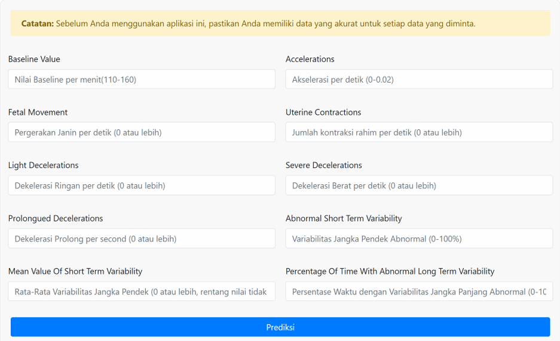
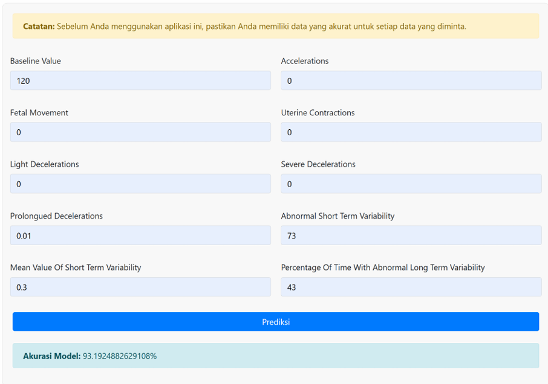
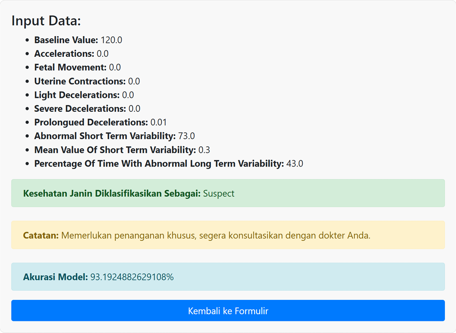

# Sistem Pakar Klasifikasi Kesehatan Janin

Sistem pakar berbasis web yang digunakan untuk mengklasifikasikan kondisi kesehatan janin menggunakan algoritma **ID3 (Decision Tree)** berdasarkan data Cardiotocography (CTG).

## Deskripsi

Aplikasi ini dikembangkan untuk membantu melakukan klasifikasi kondisi kesehatan janin berdasarkan beberapa parameter kesehatan yang diperoleh dari hasil pemeriksaan CTG. Sistem akan memberikan hasil prediksi ke dalam tiga kategori, yaitu:

- **Normal** : Kondisi janin dalam keadaan sehat.
- **Suspect** : Kondisi janin memerlukan pemantauan lebih lanjut.
- **Pathological** : Kondisi janin menunjukkan indikasi masalah serius dan memerlukan penanganan medis.

Model klasifikasi dibangun menggunakan algoritma ID3 dan diintegrasikan ke dalam aplikasi web menggunakan Flask.

## Dataset

Dataset yang digunakan terdiri dari **2.126 data kesehatan janin** yang diklasifikasikan ke dalam tiga kelas:

- Normal
- Suspect
- Pathological

## Fitur

- Prediksi kondisi kesehatan janin menggunakan algoritma ID3.
- Antarmuka web yang sederhana dan mudah digunakan.
- Menampilkan hasil klasifikasi secara langsung.
- Memberikan rekomendasi berdasarkan hasil prediksi.

## Akurasi Model

Model ID3 yang digunakan memperoleh akurasi sebesar:

**93,19%**

## Teknologi yang Digunakan

- Python
- Flask
- Scikit-Learn
- Pandas
- HTML
- CSS

## Tampilan Aplikasi

### Halaman Input Data

Pengguna memasukkan parameter kesehatan janin melalui form yang telah disediakan.



### Prediksi



### Hasil Prediksi 



## Cara Menjalankan Aplikasi

Clone repository:

```bash
git clone https://github.com/ys124xkd/fetal_expert_system.git
```

Masuk ke folder project:

```bash
cd fetal_expert_system
```

Install dependency:

```bash
pip install -r requirements.txt
```

Jalankan aplikasi:

```bash
python app.py
```

Buka browser:

```text
http://localhost:5000
```

## Struktur Folder

```text
fetal_expert_system/
│
├── static/
├── templates/
├── model.pkl
├── app.py
├── requirements.txt
└── README.md
```

## Catatan

Aplikasi ini dibuat untuk tujuan pembelajaran dan penelitian. Hasil prediksi yang diberikan sistem tidak dapat menggantikan diagnosis atau rekomendasi dari tenaga medis profesional.
